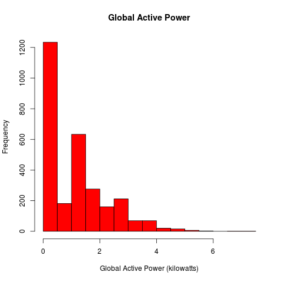

# CodeBook for the Week One EDA Project

The repository was cloned from [ExData_Plotting1](https://github.com/rdpeng/ExData_Plotting1). The REAME.md file contains the 
assignment instructions and links to the dataset.

## Reading data

The first step is to read in the data. The read was done using the *sqldf* package. This also circumvents the issue with 
*?* since the target dataset doesn't contain any. There wwere 2880 observations of 9 variables. The types, names, and sample
values are show below in table format.

```
powerData <- 
    read.csv.sql(file = "household_power_consumption.txt",
    sql = "select * from file where [Date] == '1/2/2007' or [Date] == '2/2/2007'", sep = ';')
```

|Variable              |Class     |Values                                                     |
|:---------------------|:---------|:----------------------------------------------------------|
|Date                  |character |1/2/2007, 1/2/2007, 1/2/2007, 1/2/2007, 1/2/2007, 1/2/2007 |
|Time                  |character |00:00:00, 00:01:00, 00:02:00, 00:03:00, 00:04:00, 00:05:00 |
|Global_active_power   |double    |0.326, 0.326, 0.324, 0.324, 0.322, 0.32                    |
|Global_reactive_power |double    |0.128, 0.13, 0.132, 0.134, 0.13, 0.126                     |
|Voltage               |double    |243.15, 243.32, 243.51, 243.9, 243.16, 242.29              |
|Global_intensity      |double    |1.4, 1.4, 1.4, 1.4, 1.4, 1.4                               |
|Sub_metering_1        |double    |0, 0, 0, 0, 0, 0                                           |
|Sub_metering_2        |double    |0, 0, 0, 0, 0, 0                                           |
|Sub_metering_3        |double    |0, 0, 0, 0, 0, 0                                           |

The two colums *Date* and *Time* would be better combined and converted to a date/time.

```
    powerData <- unite(powerData, DateTime, c(Date, Time), remove = TRUE, sep =":")
    # Now change the Date values into date types
    powerData %<>% mutate(DateTime=mdy_hms(DateTime))
```
Now the separate date and time have been combined into a POSIXct date/time class

|Variable              |Class  |Values                                            |
|:---------------------|:------|:-------------------------------------------------|
|DateTime              |double |2007-01-02 00:00:00, 2007-01-02 00:01:00 00:05:00 |
|Global_active_power   |double |0.326, 0.326, 0.324, 0.324, 0.322, 0.32           |
|Global_reactive_power |double |0.128, 0.13, 0.132, 0.134, 0.13, 0.126            |
|Voltage               |double |243.15, 243.32, 243.51, 243.9, 243.16, 242.29     |
|Global_intensity      |double |1.4, 1.4, 1.4, 1.4, 1.4, 1.4                      |
|Sub_metering_1        |double |0, 0, 0, 0, 0, 0                                  |
|Sub_metering_2        |double |0, 0, 0, 0, 0, 0                                  |
|Sub_metering_3        |double |0, 0, 0, 0, 0, 0  

```
# Histogram Plot1
png(filename = "plot1.png", width = 480, height = 480, units = "px", pointsize = 12, bg="white")
hist(powerData$Global_active_power, col="red", xlab = "Global Active Power (kilowatts)",
    ylab = "Frequency", main = "Global Active Power")
dev.off()
```

## Notes

1. Extra libraries used:
    - *lubridate*
    - *tidyr*
    - *dplyr*
    - *knitr*
    - *magrittr*
    - *sqldf*

2. Method of reproducing the str() function so you can print a nice table. Thanks to Martin Weber on 
[stack overflow](https://stackoverflow.com/questions/44200394/show-str-as-table-in-r-markdown)

```
data.frame(Variable = names(powerData), 
    Class = sapply(powerData, typeof), Values = sapply(powerData, 
    function(x) paste0(head(x), collapse = ", ")),
    row.names = NULL) %>% kable()
```